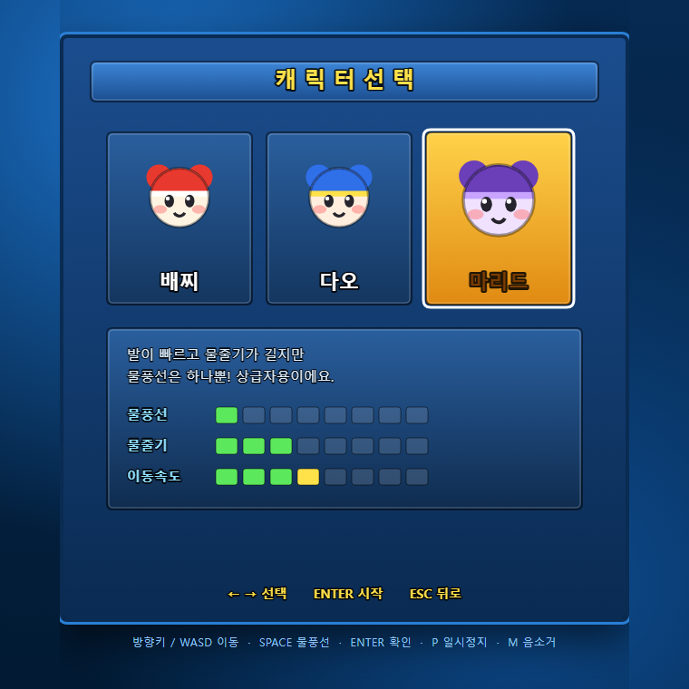
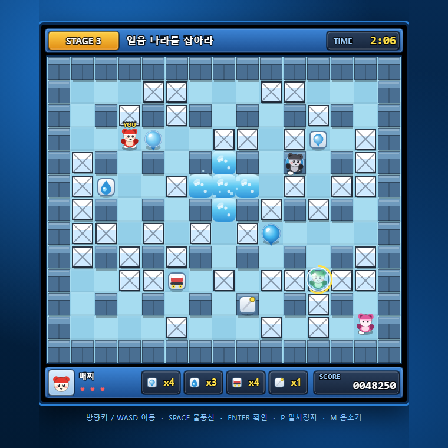
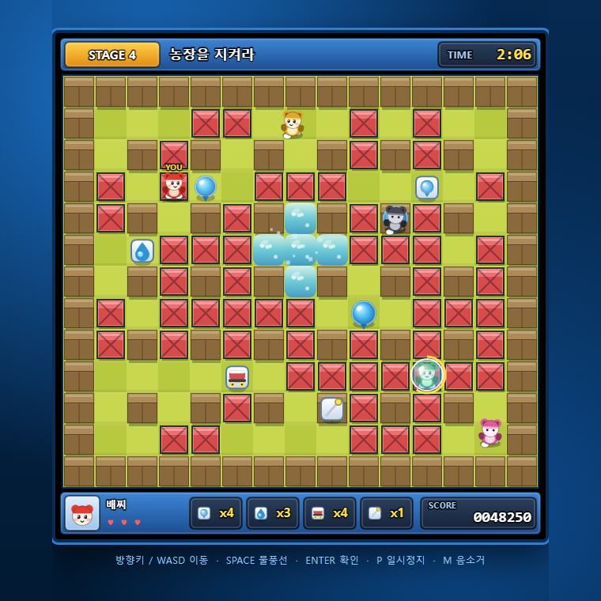

# 크레이지 아케이드 (Crazy Arcade)

추억의 **크레이지 아케이드**를 HTML5 Canvas로 재현한 웹 게임입니다.
혼자서 8개 스테이지를 클리어하는 **싱글플레이**와, 끄투처럼 방을 만들어 코드를 공유하면
친구가 바로 들어오는 **온라인 멀티플레이**(협동 / 대전)를 지원합니다.

이미지·사운드 파일이 하나도 없습니다. 캐릭터와 타일은 전부 Canvas 도형으로 그렸고,
효과음은 Web Audio API로 실시간 합성합니다.


## 바로 해보기

| | 주소 | 온라인 |
|---|---|:--:|
| **Render** (권장) | 배포 후 `https://<서비스명>.onrender.com` | 지원 |
| GitHub Pages | https://nsj9164.github.io/crazyarcade/ | 설정 필요 (아래 참고) |

로컬에서 돌리려면:

```bash
git clone https://github.com/nsj9164/crazyarcade.git
cd crazyarcade
npm install
npm start          # http://localhost:3000
```

## 조작

| 키 | 동작 |
|---|---|
| `방향키` / `WASD` | 이동 |
| `SPACE` | 물풍선 설치 / (던지기 보유 시) 밟고 있는 물풍선 던지기 |
| `SHIFT` / `X` | 점프 (점프 아이템 보유 시) |
| `ENTER` | 확인 / 다음 |
| `P` | 일시정지 (싱글) |
| `M` | 음소거 |
| `ESC` | 뒤로 / 로비 |

발차기는 아이템을 가진 채 물풍선 쪽으로 걸어가면 자동으로 나갑니다.

## 물방울에 갇히면

물줄기에 맞으면 물방울에 갇힙니다. **5초** 안에 빠져나오지 못하면 죽습니다.

- **방향키를 연타**하면 혼자 힘으로 빠져나올 수 있습니다
- **같은 편**이 부딪히면 터뜨려서 **구해줍니다**
- **상대편**이 부딪히면 터뜨려서 **그대로 죽입니다**
- **바늘**을 보유 중이면 갇히는 즉시 자동으로 탈출합니다

죽으면 그 스테이지에서는 부활하지 않고, **다음 스테이지에서 다시 살아납니다.**

## 온라인 멀티플레이

1. 타이틀에서 **온라인 대전** 선택
2. 닉네임을 넣고 **방 만들기** — 4자리 방 코드가 나옵니다
3. **초대링크 복사** 버튼으로 링크를 친구에게 전송
4. 친구가 링크로 들어오면 자동으로 방 코드가 채워집니다 (또는 코드 직접 입력)
5. 전원 **준비 완료** 후 방장이 **게임 시작**

최대 4명까지 함께 즐길 수 있고, 빈 자리는 봇으로 채울 수 있습니다.

| 모드 | 규칙 |
|---|---|
| **협동** | 힘을 합쳐 스테이지의 적을 모두 물리칩니다. 갇힌 친구를 몸으로 부딪쳐 구할 수 있어요. |
| **대전** | 서로를 물풍선으로 가두고, 마지막까지 살아남은 사람이 승리합니다. |

### 동작 방식

서버는 **게임 로직을 돌리지 않습니다.** 방 관리와 메시지 중계만 담당하고,
실제 시뮬레이션은 방장 브라우저가 처리합니다.

```
게스트 ──입력──▶ 서버 ──입력──▶ 방장(시뮬레이션)
게스트 ◀─스냅샷─ 서버 ◀─스냅샷─ 방장   (20Hz)
```

- 서버가 거의 아무 일도 하지 않아 **무료 티어로 충분**합니다
- 게스트는 자기 캐릭터를 로컬에서 미리 움직여(클라이언트 예측) 조작이 즉각 반응하고,
  방장 위치와 26px 이상 벌어지면 보정합니다
- 물풍선 설치는 카운터(seq) 방식이라 패킷이 유실되거나 중복돼도 두 번 놓이지 않습니다
- 방장이 나가면 게스트에게 안내 후 자동으로 로비로 돌아갑니다

## 게임 규칙

- 물풍선은 설치 후 **3초 뒤 십자 모양**으로 터집니다
- 물줄기에 닿은 **다른 물풍선도 연쇄 폭발**합니다
- 상자를 부수면 **34% 확률로 아이템**이 나옵니다
- 물에 맞으면 물방울에 갇히고, 5초 안에 탈출하지 못하면 사망합니다
- 협동에서는 목숨이 남아 있으면 3초 뒤 부활합니다 (능력치는 조금 줄어듭니다)

## 아이템

상자를 부수면 나옵니다. **물줄기에 닿으면 씻겨 사라지니** 먼저 주우세요.
(상대를 죽여도 아이템은 떨어지지 않습니다.)

### 누적 — 먹을수록 계속 쌓입니다

| 아이템 | 효과 |
|---|---|
| 물방울 | 동시에 놓을 수 있는 물풍선 +1 |
| 물줄기 | 폭발 길이 +1 |
| 신발 | 이동 속도 +1 |

### 보유 — **최대 2개**까지. 꽉 찬 상태에서 먹으면 **먼저 먹은 것이 밀려납니다**

| 아이템 | 효과 |
|---|---|
| 점프 | `SHIFT` 로 앞으로 건너뜁니다 (벽·상자·물풍선을 넘어감) |
| 바늘 | 물방울에 갇히는 즉시 혼자 빠져나옵니다 (1회 소모) |
| 던지기 | 밟고 있는 물풍선을 바라보는 방향으로 던집니다 |
| 발차기 | 물풍선에 부딪히면 발로 차서 굴려보냅니다 |
| 방패 | 물줄기를 한 번 막아줍니다 (1회 소모) |

### 즉시 발동 — 보유하지 않고 먹는 순간 적용됩니다

| 아이템 | 효과 |
|---|---|
| 악마 | 방향키가 반대로 되고 물풍선이 자동으로 마구 나갑니다 (10초) |
| 슈퍼맨 | 무적 · 물풍선 무한 · 최고 속도. **악마에 걸려 있으면 풀립니다** (8초) |
| 거미줄 | 밟으면 느려집니다 (5초) |
| 우주선 | 벽 말고는 다 통과합니다. **정상/고장 두 종류가 랜덤** (고장은 금방 멈추고 무적도 없음) |

## 캐릭터



| 캐릭터 | 물풍선 | 물줄기 | 속도 | 특징 |
|---|:--:|:--:|:--:|---|
| **배찌** | 2 | 2 | 3 | 모든 능력이 고른 기본 캐릭터. 초보자 추천 |
| **다오** | 3 | 1 | 3 | 물풍선을 많이 놓아 함정과 길막에 강함 |
| **마리드** | 1 | 3 | 4 | 빠르고 물줄기가 길지만 물풍선은 하나. 상급자용 |

## 스테이지

테마별 색상 · 상자 밀도 · 적 수 · AI 난이도가 다른 **8개 스테이지**로 구성됩니다.

| # | 스테이지 | # | 스테이지 |
|:--:|---|:--:|---|
| 1 | 로두마니의 문턱 | 5 | 로두마니의 문턱 II |
| 2 | 필레라 사막 | 6 | 워터파크 대소동 |
| 3 | 얼음 나라를 잡아라 | 7 | 위대한 시나리 |
| 4 | 농장을 지켜라 | 8 | 로두마니 최종 결전 |

| 얼음 나라를 잡아라 | 농장을 지켜라 |
|---|---|
|  |  |

## 적 AI

단순한 랜덤 이동이 아니라, 매 프레임 다음을 계산합니다.

- **위험 지역 예측** — 설치된 모든 물풍선의 폭발 반경을 미리 계산해 위험 타일 집합을 만듭니다
- **회피** — 위험 지역에 있으면 BFS로 가장 가까운 안전 타일을 찾아 도망갑니다
- **추격** — 안전할 때는 적을 쫓고, 멀면 가까운 상자를 부수러 갑니다
- **자폭 방지** — 물풍선을 놓기 전에 *놓았다고 가정한* 위험 지도를 다시 계산해,
  **탈출로가 있을 때만** 설치합니다
- **협동** — 물방울에 갇힌 아군을 발견하면 다가가 터뜨려 구해줍니다

## 배포

### Render (온라인 멀티플레이용)

`render.yaml` 이 들어 있어 Blueprint로 한 번에 배포됩니다.

1. [render.com](https://render.com) 가입 후 GitHub 계정 연결
2. **New → Blueprint** → 이 저장소 선택 → **Apply**
3. 몇 분 뒤 `https://<서비스명>.onrender.com` 으로 접속

> 무료 플랜은 15분간 요청이 없으면 서버가 잠듭니다.
> 이때 첫 접속은 약 50초 걸리고, 그 뒤로는 정상 속도입니다.

### GitHub Pages (클라이언트만)

`main` 에 푸시하면 워크플로가 `public/` 을 Pages에 올립니다.
싱글플레이는 바로 되지만, 온라인은 정적 호스팅이라 서버가 없으므로
`public/config.js` 에 Render 주소를 넣어야 동작합니다.

```js
window.CA_SERVER = 'https://<서비스명>.onrender.com';
```

비워두면 Pages에서는 온라인 메뉴가 안내 문구를 띄우고 싱글플레이만 동작합니다.

## 구조

```
public/          클라이언트 (정적 파일)
  index.html     화면 + 로비 UI
  game.js        게임 코어 (싱글/호스트/게스트 공용)
  net.js         WebSocket 통신 + 로비 동작
  config.js      서버 주소 설정
server/
  server.js      방 관리 + 메시지 중계 (게임 로직 없음)
test/
  run-tests.js   서버 / 게임코어 / 통합 테스트
```

## 테스트

```bash
npm test
```

`52개 검사`가 실행됩니다.

- **서버** — 방 생성·입장·정원·중복입장 차단, 채팅, 권한 검사(게스트가 스냅샷을 보내면 무시),
  방장 이탈 시 권한 이양, 빈 방 정리
- **게임 코어** — 싱글/협동/대전을 헤드리스로 각각 7,000~9,000 프레임 구동,
  승패 판정, 스냅샷 왕복 후 맵·플레이어·위치 일치, 같은 시드 → 같은 맵,
  맵 320개 전부 완전 연결 및 스폰 안전성
- **아이템** — 보유 슬롯 2칸 FIFO, 누적/보유/즉시 구분, 악마 조작 반전과 자동 발사,
  슈퍼맨의 악마 해제, 방패·바늘 1회 소모, 점프·던지기·발차기 동작,
  물줄기에 닿은 아이템 소멸
- **물방울 판정** — 상대편은 죽이고 같은 편은 살리는지, 스테이지 중 부활이 없고
  다음 스테이지에서 되살아나는지, 물풍선을 놓은 자리에서 네 방향 모두 빠져나올 수 있는지
- **통합** — 실제 서버에 실제 WebSocket으로 3명이 접속해 한 판을 진행하고,
  세 클라이언트의 맵과 플레이어 구성이 일치하는지, 방장 이탈이 올바르게 처리되는지 확인

## 라이선스

MIT

> 이 프로젝트는 원작 게임에 대한 팬 리메이크이며 학습·비상업적 목적으로 제작되었습니다.
> *Crazy Arcade* 및 관련 캐릭터의 권리는 원저작자에게 있습니다.
